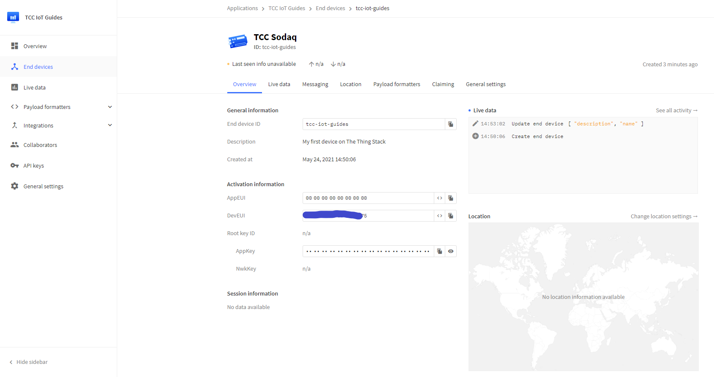
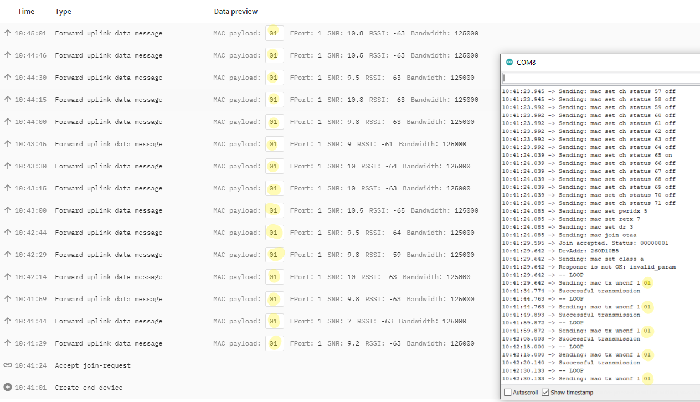

# SODAQ ExpLoRer Guide

This guide is designed to help beginners set up a SODAQ ExpLoRer to connect to The Things Network.

## What you will need
To follow this guide you will need the following things:
- A SODAQ ExpLoRer which can be bought [here](https://shop.sodaq.com/explorerrn2903a-us.html)
  - see [here](https://support.sodaq.com/Boards/ExpLoRer/) for support documents.
- A micro USB connector which is included with the SODAQ ExpLoRer
- A computer to connect to the SODAQ ExpLoRer and write the code

You will also need to be in range of a Gateway connected to The Things Network which you can find out about [here](https://www.thethingsnetwork.org/community).

## Step 1 - Physical Setup
To set up the device, plug the Arduino into your computer.

> It's that easy. The LoRa module, antenna and microcontroller (Arduino), are all together on the board.

1. Use the USB port on the SODAQ ExpLoRer and the USB cable to connect to a computer.


## Step 2 - Setting up the environment
### Install Arduino IDE
To get started you will first need to install the Arduino IDE which can be downloaded [here](https://www.arduino.cc/en/software).

After downloading the appropriate option for your system, run the installer and complete the installation process.

Once the program is done installing, open the Arduino IDE.

### Configure Arduino IDE for the SODAQ ExpLoRer
Now that we are in the Arduino IDE, install the SODAQ ExpLoRer Board and some libraries that will be use throughout the guide. To do this:
1. First navigate to the Preferences window by going to `File -> Preferences`.
1. Now, in the textbox named 'Additional Boards Manager URLs:' paste the following `http://downloads.sodaq.net/package_sodaq_samd_index.json`.
1. Then click the Ok button


> This will allow you to find the package that includes the SODAQ ExpLoRer board.

4. Next navigate to the boards manager by going to `Tools -> Board: <...> -> Boards Manager...`
1. Then using the search bar enter `SODAQ SAMD Boards` and install the package with the same name.
1. Once the package is finished installing click the close button.


### Choose Board and Port
Now that we have installed the `SODAQ SAMD Boards` package, select your SODAQ ExpLoRer Board. To do this navigate and click `Tools -> Board: <...> -> SODAQ SAMD (32-bits ARM Cortex-M0+) Boards -> SODAQ ExpLoRer`


Now that the board has been correctly selected, we need to select the COM port the computer will use to communicate with the SODAQ ExpLoRer. To do this, Navigate to `Tools -> Port: <...>` and then select the COM port for the board you're using.

> *If multiple Arduinos (SODAQ ExpLoRer being one) are plugged into the computer, they will each have their own COM Port.*

> *TIP: If there's a few options there or you're not sure:*
> 1. *Make a note or take a screenshot of the choices.*
> 1. *Unplug the SODAQ ExpLoRer from the computer and check to see which one disappeared from the list.*
> 1. *Plug the SODAQ ExpLoRer back into the computer, notice the choice will reappear in the list.*
> 1. *Select that COM port you now know is associated with the SODAQ ExpLoRer.*


At this stage you can now upload a program to the Arduino, and it's a good idea to do so and check your setup is working. We will upload the 'blink example' to the SODAQ ExpLoRer to test. To do this:

1. Navigate to `File -> Examples -> 01.Basics -> Blink`
1. Click the `upload` button (the right-facing arrow next to the tick).

This will compile, and upload the program to the Arduino. If successful you should see a 'Done uploading' message in the Arduino IDE, and the blue LED on the SODAQ ExpLoRer should blink once per second.


### Install & Configure Library for SODAQ ExpLoRer
Now that you have selected the correct Board there are three Libraries to install.

1. First, open the library manager by going to `Tools -> Manage Libraries`
1. Next, in the bar at the top of the window search for and install the following libraries. _(much like installing the `SODAQ SAMD Boards` in the Boards Manager)_
    - `Sodaq_RN2483`
    - `Sodaq_wdt`
    - `TheThingsNetwork`
1. Once all of the installs are complete, click close, as the environment is now finished setting up.


### Getting your device EUI
The device EUI is a code that will be used to identify the device and will be needed when adding the device to The Things Network.

1. First, plug in your SODAQ ExpLoRer to your computer using the micro USB cable.
1. Then Navigate to `Tools -> Port:` and ensure that the port that has the SODAQ device is selected.
1. Next, Replace the text in the main section of the Arduino IDE with the following code:

```
/**
 * Works with:
 * SODAQ Mbili
 * SODAQ Autonomo
 * SODAQ One
 * SODAQ Explorer
 *
 */

#define CONSOLE_STREAM SERIAL_PORT_MONITOR

#if defined(ARDUINO_SODAQ_EXPLORER)
#define LORA_STREAM Serial2
#else
#define LORA_STREAM Serial1
#endif

#define LORA_BAUD 57600
#define DEBUG_BAUD 57600

void setup() {
  // put your setup code here, to run once:
  // Enable LoRa module
  #if defined(ARDUINO_SODAQ_AUTONOMO)
  pinMode(BEE_VCC, OUTPUT);
  digitalWrite(BEE_VCC, HIGH); //set input power BEE high
  #endif

  //wait forever for the Serial Monitor to open
  while(!CONSOLE_STREAM);

  //Setup streams
  CONSOLE_STREAM.begin(DEBUG_BAUD);
  LORA_STREAM.begin(LORA_BAUD);

  #ifdef LORA_RESET
  //Hardreset the RN module
  pinMode(LORA_RESET, OUTPUT);
  digitalWrite(LORA_RESET, HIGH);
  delay(100);
  digitalWrite(LORA_RESET, LOW);
  delay(100);
  digitalWrite(LORA_RESET, HIGH);
  delay(1000);

  // empty the buffer
  LORA_STREAM.end();
  #endif
  LORA_STREAM.begin(57600);

  // get the Hardware DevEUI
  CONSOLE_STREAM.println("Get the hardware serial, sending \"sys get hweui\\r\\n\", expecting \"xxxxxxxxxxxxxxxx\", received: \"");
  delay(100);
  LORA_STREAM.println("sys get hweui");
  delay(100);

  char buff[16];
  memset(buff, 0, sizeof(buff));

  LORA_STREAM.readBytesUntil(0x20, buff, sizeof(buff));
  CONSOLE_STREAM.print(buff);

  CONSOLE_STREAM.println();
}

void loop() {
  // put your main code here, to run repeatedly:
}
```


4. Once you have copied the code into the Arduino IDE Click the arrow in the upper left corner to upload the code to the SODAQ ExpLoRer
1. After the code has finished uploading open the serial monitor by navigating to `Tools -> Serial Monitor`
1. Finally, Keep the 16-character EUI code from the Serial Monitor handy, you will need it later.


> Be careful of trailing 'special characters' the code in the screenshot above ends in "E75" followed by a box. Be careful to only copy the 16-character EUI only in the following steps

## Step 3 - Sign Up on The Things Network
Now that our environment is set up and we have the SODAQ ExpLoRer EUI code, we can prepare to connect it to The Things Network by following the steps below.

1. Sign in to [The Things Network](https://thethingsnetwork.org)
  - Or create an account if you don't have one at [The Things Network](https://account.thethingsnetwork.org/register)
1. Go to the console by clicking on the profile icon and clicking the console option.
1. Select applications.
1. Choose an existing application if you already have one you'd like to use, or select add application.
  - If making a new application. Fill out the application ID with a unique name, add a Description and press `add application`.
1. Press the `register device` button in the devices section.
1. Enter a unique name for the device ID.
1. Enter the EUI code you copied from the previous step into the `Device EUI` section.
1. Click `Register`.

> Your device will now be registered and is ready to connect


We are now be on a page which includes a device overview. Information on this page will be used to configure the Arduino to connect and Authenticate with The Things Network.



## Step 4 - Connecting The SODAQ ExpLoRer to The Things Network
Now that a device is registered on The Things Network all that is left to do is configure the Arduino with that registration.

- In the Arduino IDE Navigate to `File -> Examples -> TheThingsNetwork -> SendOTAA` which will open a new window.


In the code that has just been opened in the new window, we will need to change 2 things:
1. APPEUI
1. APPKEY

The APPEUI and, APPKEY come from the Device Overview that you created in Step 3 - Setup on The Things Network.

Find this section of code, and replace the 0's with the actual codes
```
// Set your AppEUI and AppKey
const char *appEui = "0000000000000000";
const char *appKey = "00000000000000000000000000000000";
```

Also change the values of the variables `loraSerial`, `debugSerial` and `freqPlan` to the following.

```
#define loraSerial Serial2
#define debugSerial SerialUSB

// Replace REPLACE_ME with TTN_FP_EU868 or TTN_FP_US915
#define freqPlan TTN_FP_AU915
```

> freqPlan is set depending on the frequency plan of your device and your country. (Click [here](https://www.thethingsnetwork.org/docs/lorawan/frequencies-by-country.html) for an overview of all frequency plans per country).


Click the arrow in the upper left corner to upload the code to the SODAQ ExpLoRer

After waiting for the code to upload you can now open the Serial Monitor through `Tools -> Serial Monitor` and see the output. If everything went well it should post a Successful transmission every 10 seconds which you will also be able to see on the things network website in the device data section.

*Don't be worried if it fails to connect a few times. In the screenshot below, the first attempt to connect failed (yellow line), and the second attempt was successful (blue line)*


## Step 5 - Customising your message
Right now, the example code is sending one byte of information to The Thing Network to tell if the LED is on or off. This can be changed to a number of different things like the output of different sensors.

As an example, lets change the message from the state of the LED to the state of the onboard button located on the opposite side of the board from the USB port.

This can be done by adding `pinMode(BUTTON, INPUT);` to the setup function to initialize the pushbutton pin as an input.
Then changing the payload to be `payload[0] = (digitalRead(BUTTON) == HIGH) ? 1 : 0;`.

When run this will make the SODAQ ExpLoRer send a 1 if the button is not being pressed and a 0 if the button is being pressed.

Below is the final Code for the setup and loop functions:
```
void setup()
{
  loraSerial.begin(57600);
  debugSerial.begin(9600);

  // Wait a maximum of 10s for Serial Monitor
  while (!debugSerial && millis() < 10000)
    ;

  pinMode(BUTTON, INPUT);

  debugSerial.println("-- STATUS");
  ttn.showStatus();

  debugSerial.println("-- JOIN");
  ttn.join(appEui, appKey);
}

void loop()
{
  debugSerial.println("-- LOOP");

  // Prepare payload of 1 byte to indicate LED status
  byte payload[1];
  payload[0] = (digitalRead(BUTTON) == HIGH) ? 1 : 0;

  // Send it off
  ttn.sendBytes(payload, sizeof(payload));

  delay(10000);
}
```


